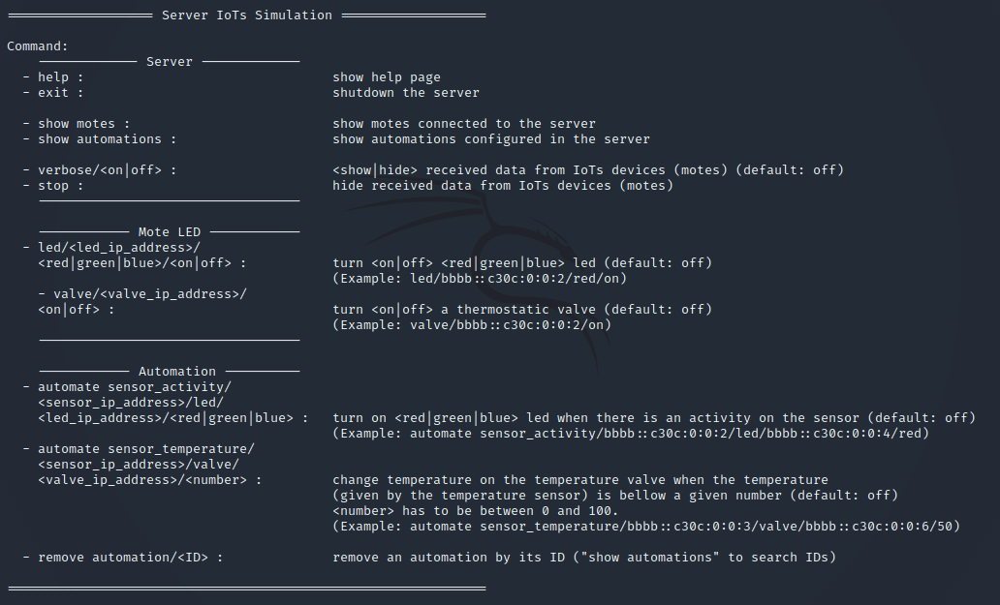
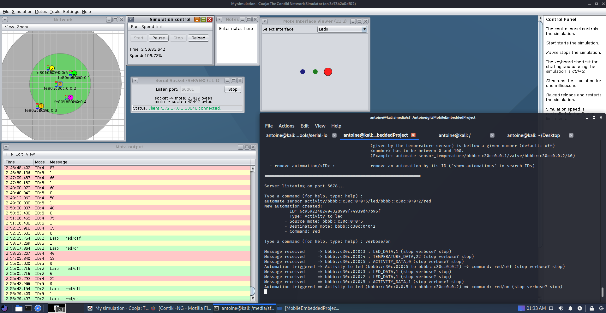
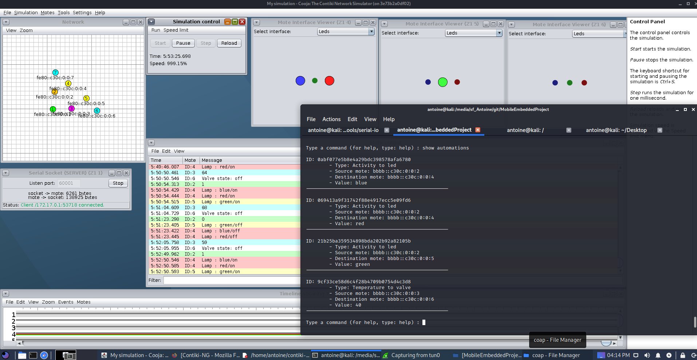

# Automations and IoT's control with Contiki-ng & Cooja simulation

## LINGI2145 - Mobile and embedded computing

The goal of this project is to develop a proof of concept and a communication protocol for a new Internet of Things (IoT) ecosystem. This ecosystem consists of several interconnected devices such as activity sensors, temperature sensors, connected lamps, etc. This ecosystem is controlled by a server which can make commands and automations on it.

#### AUTHORS:

Andrieux Antoine M-SECUC ULB 000443686 - antoine.andrieux@student.uclouvain.be \
Colson Thibaut M-SECUC ULB 000428169 - thibaut.colson@student.uclouvain.be \
Amine Djuric M-INFO ULB 000426212 - amine.djuric@student.uclouvain.be

## Requirements

- Contiki OS with Cooja (installed with docker: https://github.com/contiki-ng/contiki-ng/wiki/Docker)
- Python 3

## Installation

1. Put this project in the contiki folder (for example, "home/user/contiki-ng/MobileEmbeddedProject")

## Running

1. Start Cooja in your Contiki docker instance (command: _contiker cooja_).
2. Create a new simulation.
3. Add a Z1 mote with the _border/border-router.c_ file (This will be the border gateway).
4. Right click on the new border-router mote. Then, click on _"More tools for Z1 1"_. Then, click on _"Serial Socket (SERVER)", to create a serial connector to connect the border router to the server. On the new panel, click _"Start"_ with the given port (for example, port \_60001_).
5. Add one or multiple Z1 motes with the _motes/activity_sensor.c_ to get an activity sensor and/or _motes/temperature_sensor.c_ to get a temperature sensor. These are the data senders.
6. Add one or multiple Z1 motes with the _motes/lamp.c_ to get an RGB lamp and/or _motes/valve.c_ to get a thermostatic valve. These are the command receivers.
7. Build and the get the executable of tunslip6 in _home/user/contiki-ng/tools/serial-io/_ .
8. Run, on the host machine, the command: _sudo ./tunslip6 -a 172.17.0.2 -p 60001 bbbb::1/64_ .
9. Run, on the host machine, the server with this command: _python server.py_
10. From there, you have the possibility to run commands and automations on these motes/IoT's (shown on section **Commands**).

**TIPS**: You can change the speed of the simulation on the _Simulation Control_ panel ==> _Speed limit_

## Simulation

- There is a simulation example with multiple motes that you can open in Cooja (see _simulation_examples/simulation.csc_).
- Few pictures of this simulation are in the same directory to show the automation process.

## Commands

## Simulation examples

#### Command of a LED:

#### Multiple automations:

